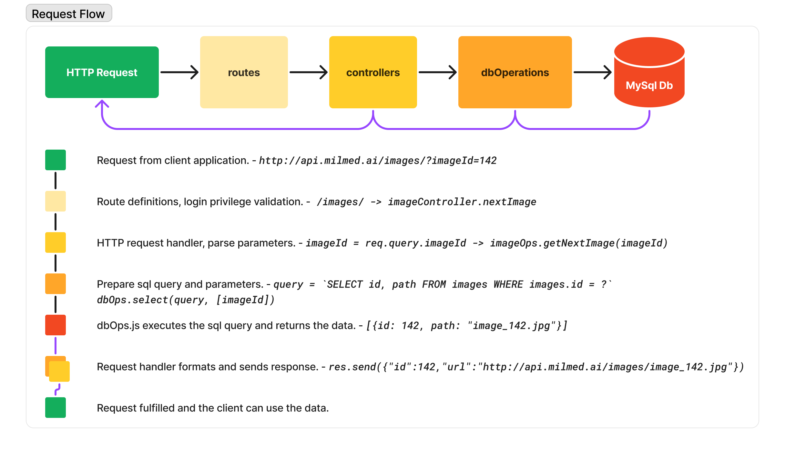

# API - Server
(As of 25 October 2023)

## Setup

Prerequisites:
- A MySql database - We are using [MariaDB](https://mariadb.org/) which uses InnoDb as the transaction storage engine.

```bash
# Create the database
mysql -e 'CREATE DATABASE pathapp'
# Create all tables
mysql pathapp < ./database/pathapp.sql
mysql pathapp < ./database/updatetotask.sql
# Make a super admin user with a SSO google email. Replace [NAME] and [EMAIL] below.
mysql test -e 'INSERT INTO users (fullname, username, password, is_enabled, is_pathologist, is_uploader, is_admin) VALUES ("[NAME]", "[EMAIL]", "", 1, 1, 1, 1)'

# install node modules
npm install
```

Next, duplicate **.env.bk** as .env for a development environment. Then populate the fields to resemble your setup. For example when running the app in development mode **IMAGE_URL**, **BACKEND_URL**, and **FRONTEND_URL** might look like below.
```bash
IMAGE_URL="http://localhost:3333/images/"
BACKEND_URL="http://localhost:3333"

FRONTEND_URL="http://localhost:3000"
```
When setting up staging or production sites, duplicate **.env.bk** as **.env.staging** and **.env.production** respectively.

## Start Server
**Development Mode**
```bash
npm run dev
```
**Production Mode**
You can run production as you would a development mode where nodejs will watch for changes and relaunch the server when needed. The other option is to launch the server and have the [pm2](https://pm2.keymetrics.io/docs/usage/quick-start/) daemon monitor the app.

1. **watch:** `npm run production watch`
or
2. **deploy:** `npm run production deploy`

*Note: You can name your pm2 app by using the this updated deploy command:
`npm run production deploy -- --name pathapp`*

# HTTP Requests



Most endpoints are passed through a combination of authentication middleware in **lib/functions.js**. When combining these middlewares, the first should be **isLoggedIn** as this will check with passport.js to see if the user has logged in. In that process a **user** property is attached to the req object and is subsequently checked by the other auth middlewares.
 - **isEnabled** - User's account is enable. In the future we may want to disable an account but not delete it.
 - **isAdmin** - Does the user have admin privileges, i.e. Can they create other users.
 - **isPathologist** - Is the user allowed to make gradings on task images.
 - **isUploader** - Is user allowed to upload images and create tasks... Is the user an Investigator.

 These can be combined and inserted into an express.js route as follows...
 ```js
import { Router } from 'express'
import imageController from '../controllers/imageController.js'
import { isLoggedIn, isEnabled, isUploader, isPathologist, asyncHandler } from '../lib/functions.js' 

const router = Router()
const isValid = [isLoggedIn, isEnabled, isPathologist]

router.get('/my-endpoint', isValid, asyncHandler(imageController.nextImage))

export default router
 ```

 Most endpoints are defined in **routes** folder files. With the exception of `/hotornot`, `/isLoggedIn`, and static images, which are defined in the main **app.js** file. To add a new api path, you would want to attach the route file in **app.js** as follows...

 ```js
import customRoutes from './routes/custom.js'
...
app.use('/custom', customRoutes)
```

## Endpoints:
### /data/... - routes/data.js
| type | route                 | description                                                      | controller                                                                  |
|------|-----------------------|------------------------------------------------------------------|-----------------------------------------------------------------------------|
| GET  | **/data/**            | get task stats                                                   | [dataController.getData](#dataController-getData)                           |
| GET  | **/data/perUsers**    | get task stats per users                                         | [dataController.getDataPerUsers](#dataController-getDataPerUsers)           |
| GET  | **/data/perImages**   | get task stats per images                                        | [dataController.getDataPerImages](#dataController-getDataPerImages)         |


### /images/... - routes/images.js
| type | route                 | description                                                      | controller                                                                  |
|------|-----------------------|------------------------------------------------------------------|-----------------------------------------------------------------------------|
| GET  | **/images/**          | get next image                                                   | [imageController.nextImage](#imageController-nextImage)                     |
| GET  | **/images/queue**     | get list of image ids                                            | [imageController.getNextImageIds](#imageController-getNextImageIds)         |
| POST | **/images/**          | upload images                                                    | [imageController.uploadAndSaveImages](#imageController-uploadAndSaveImages) |
| POST | **/images/tag**       | create a tag/folder                                              | [imageController.createTag](#imageController-createTag)                     |
| POST | **/images/renameTag** | rename a tag/folder                                              | [imageController.updateTag](#imageController-updateTag)                     |
| POST | **/images/moveTag**   | reassign a tag/folder’s parent tag/folder                        | [imageController.moveTag](#imageController-moveTag)                         |
| POST | **/images/deleteTag** | delete a tag/folder                                              | [imageController.deleteTag](#imageController-deleteTag)                     |
| POST | **/images/rename**    | rename an image                                                  | [imageController.renameImage](#imageController-renameImage)                 |
| POST | **/images/move**      | move an image to a different tag/folder                          | [imageController.moveImage](#imageController-moveImage)                     |
| POST | **/images/delete**    | delete an image                                                  | [imageController.deleteImage](#imageController-deleteImage)                 |

### /tasks/... - routes/tasks.js
| type | route                 | description                                                      | controller                                                                  |
|------|-----------------------|------------------------------------------------------------------|-----------------------------------------------------------------------------|
| GET  | **/tasks/**           | get all tasks assigned                                           | [taskController.getAllTasks](#taskController-getAllTasks)                   |
| GET  | **/tasks/owned**      | get all task owned                                               | [taskController.getOwnedTasks](#taskController-getOwnedTasks)               |
| GET  | **/tasks/table**      | get data for the task table                                      | [taskController.getTaskTable](#taskController-getTaskTable)                 |
| GET  | **/tasks/progress**   | get a specific task’s progress                                   | [taskController.getTaskProgress](#taskController-getTaskProgress)           |
| GET  | **/tasks/observers**  | get observers associated with a task.                            | [taskController.getObservers](#taskController-getObservers)                 |
| GET  | **/tasks/images**     | get images assigned to task in the virtual file system structure | [taskController.getImages](#taskController-getImages)                       |
| POST | **/tasks/**           | create a task                                                    | [taskController.createTask](#taskController-createTask)                     |
| POST | **/tasks/update**     | update a task                                                    | [taskController.updateTask](#taskController-updateTask)                     |
| POST | **/tasks/delete**     | delete a task                                                    | [taskController.deleteTask](#taskController-deleteTask)                     |
| POST | **/tasks/observers**  | assign observers to a task                                       | [taskController.updateObservers](#taskController-updateObservers)           |
| POST | **/tasks/images**     | assign images to a task                                          | [taskController.setTaskImages](#taskController-setTaskImages)               |

### /users/... - routes/users.js
| type | route                 | description                                                      | controller                                                                  |
|------|-----------------------|------------------------------------------------------------------|-----------------------------------------------------------------------------|
| GET  | **/users/**           | get users for admin purposes                                     | [userController.getUsers](#userController-getUsers)                         |
| POST | **/users/**           | create a new user                                                | [userController.createUser](#userController-createUser)                     |

### /hotornot - app.js
| type | route                 | description                               | controller       |
|------|-----------------------|-------------------------------------------|------------------|
| Post | **/hotornot**         | add yes, no, maybe rating on an image     | [n/a](#hotornot) |

## Controllers
Inside the **controllers** folder are files that handle the logic for multiple HTTP requests. They will often pull queries from the request and feed them into database operations and typically return the retrieved data.

### dataController.js
Request handlers for data/stats views.
- **getData**<a id='dataController-getData'></a> - returns the data for a specific task. Allows admins to change the user id to view other user’s(investigator’s) tasks.
    `params: { task_id: Number, user_id: Number }` user_id optional
    `returns: JSON { total, yes, no, maybe }`
- **getDataPerUsers**<a id='dataController-getDataPerUsers'></a> - Similar to above, but returns users specific stats toward a task.
    `params: { task_id: Number, user_id: Number }` user_id optional
    `returns: JSON [{ user_id, fullname, total, yes, no, maybe }]`
- **getDataPerImages**<a id='dataController-getDataPerImages'></a> - Similar to above, but returns image specific stats toward a task.
    `params: { task_id: Number, user_id: Number }` user_id optional
    `returns: JSON [{ image_id, path, total, yes, no, maybe }]`

### imageController.js
Serves images queues to users as well as handles majority of file management requests.
- **nextImage**<a id="imageController-nextImage"></a> - give an image id, will return that image’s url
    `params: { imageId: Number }`
    `returns: JSON { id, url }`
- **getNextImageIds**<a id="imageController-getNextImageIds"></a> - given a task id, a user is returned a list of image ids for rating
    `params: { taskId: Number }`
    `returns: JSON [ Number(s) ]`
- **renameImage**<a id="imageController-renameImage"></a> - given an image id and new name, the image will be renamed in the database.
    `POST body: JSON { imageId: Number, newName: String }`
- **moveImage**<a id="imageController-moveImage"></a> - associates image with a different tag/folder
    `POST body: JSON { imageId: Number, oldParentTagId: Number, newParentTagId: Number }`
- **deleteImage**<a id="imageController-deleteImage"></a> - removes image from database and deletes the file from the system.
    `POST body: JSON { imageId: Number }`
- **createTag**<a id="imageController-createTag"></a> - creates a new tag/folder, sends a new virtual folder object back
    `POST body: JSON { tagName: String }`
    `returns: JSON { id, name, contents: Array, type }`
- **updateTag**<a id="imageController-updateTag"></a> - rename a tag/folder
    `POST body: JSON { tagId: Number, tagName: String }`
- **moveTag**<a id="imageController-moveTag"></a> - associates a tag/folder with a parent tag/folder.
    `POST body: JSON { tagId: Number, oldParentTagId: Number, newParentTagId: Number }`
- **deleteTag**<a id="imageController-deleteTag"></a> - delete a tag/folder
    `POST body: JSON { tagId: Number }`
- **uploadAndSaveImages**<a id="imageController-uploadAndSaveImages"></a> - chain of handlers to process bulk file upload and save files to the database. [Additional Upload Info](#images)
    - **uploadImages** - in **./lib/upload.js**. Handles multipart upload with busboy. Saves file to a temp folder while uploading then moves them to a permanent location upon upload completion. Adds the `files` property to the `req` object which tracks the state of the upload.
    - **saveUploadsToDb** - Write successful file upload info to the db, creates associated tag/folder entries in the db, and links the file info to tag/folders in the db.
    - **removeFailedImageSaves** - Any failed entries in the database are removed from the file system to prevent overloading the disk with unused files.
    - **saveImages** - Filters file upload output to relevant data only (Return to sender the status of the upload).
        `returns: JSON [{ filename, mimeType, id, relPath, success, message }]`

### taskController.js
Most task oriented request handling. The one exception is getImages, which we previously reviewed, and is used for assigning images to tasks and the file manager.
- **getAllTasks**<a id="taskController-getAllTasks"></a> - Returns all tasks assigned to the user/observer.
    `returns: JSON [{ id, short_name, prompt }]`
- **getOwnedTasks**<a id="taskController-getOwnedTasks"></a> - Returns all tasks owned/associated with a user id. Admins can change user id.
    `params: { user_id: Number }` optional
    `returns: JSON [{ id, prompt, short_name }]`
- **getTaskTable**<a id="taskController-getTaskTable"></a> - Returns all data needed to build a task table associated with a user id.
    `returns: JSON [{ id, short_name, prompt, image_count, observer_count, progress }]`
- **getTaskProgress**<a id="taskController-getTaskProgress"></a> - Returns an individual task's progress, for updating the getTaskTable data.
    `params: { task_id: Number }`
    `returns: JSON { progress }`
- **createTask**<a id="taskController-createTask"></a> - Handle a post request to create a new task. Returns new task id.
    `POST body: JSON { short_name: String, prompt: String }`
    `returns: JSON { newTaskId }`
- **updateTask**<a id="taskController-updateTask"></a> - Handle a post request to update a task.
    `POST body: JSON { id: Number, short_name: String, prompt: String }`
- **deleteTask**<a id="taskController-deleteTask"></a> - Handle a post request to delete a task.
    `POST body: JSON { id: Number }`
- **getObservers**<a id="taskController-getObservers"></a> - Handle a get request for a task’s observers(users).
    `params: { task_id: Number }`
    `returns: JSON [{ id, name, applied: Number }]` `applied` should be treated as a boolean (0 or 1).
- **updateObservers**<a id="taskController-updateObservers"></a> - Update/Set observers for a task id.
    `POST body: JSON { task_id: Number, observerIds: String }` `observerIds` should be a stringified Array of Numbers.
- **getImages**<a id="taskController-getImages"></a> - Get images and tag/folder structure for task image assignment.
    `params: { task_id: Number }`
    `returns: JSON [{ id, name, contents: Array, type }]` Objects with a `contents` property can be thought of as folders.
    - File/image objects that are often in `contents`: `[{ id: Number, name: String, selected: Boolean, type: String }]`
    - *Note: Folders can contain other folders and files. Essentially a tree like structure of folders and files.*
- **setTaskImages**<a id="taskController-setTaskImages"></a> - Assign select images to a task.
    `POST body: JSON { task_id: Number, imageIds: String }` `imageIds` should be a stringified Array of Numbers.

### userController.js
Handle user oriented requests.
- **getUsers**<a id="userController-getUsers"></a> - Get a list of users.
    `returns: JSON [{ id, fullname, username }]`
- **createUser**<a id="userController-createUser"></a> - Insert new user via post.
    ```js
    POST body: JSON {
        fullname: String,
        email: String,
        password: String,
        permissions: {
            enabled: Boolean,
            uploader: Boolean,
            pathologist: Boolean,
            admin: Boolean },
        submittionSuccess: null,
        message: String,
        id: Number}
    ```
    - The values to `permissions` fields should be truthy.
    - *Note: `submittionSuccess`, `message`, and `id` should be overwritten in the response.*
    - *Note: `password` should be an empty string as the system is not currently using passwords for login.*
    - *Note: Emails are unique keys for users. If a duplicate email is supplied, the server will respond with `409` and the message `"Email already exists in database."` as well as the submitted user.*
    <br />
    
    ```js
    returns body: JSON {
        fullname: String,
        email: String,
        password: String,
        permissions: {
            enabled: Boolean,
            uploader: Boolean,
            pathologist: Boolean,
            admin: Boolean },
        submittionSuccess: null,
        message: String,
        id: Number}
    ```
    -  *Note: The responses is not updated as intended, but if a 200 response is part of the return, the user was created.*


## Auth

- [/isLoggedIn](#isLoggedIn)
- [/auth/success](#authsuccess)
- [/auth/failure](#authfailure)
- [/auth/logout](#authlogout)
- [/auth/google](#authgoogle)
    - [/auth/google/callback](#authgooglecallback)

Current methods of authentication:

- Google

/isLoggedIn<span id="isLoggedIn" />
: Checks whether or not the user has been authenticated. Sends the user (see `lib/auth.js deserializeUser`) if they are logged in and `false` if not.

/auth/success<span id="authsuccess" />
: Redirection route for successful authentication. ~~Users that authenticate correctly but are not allowed by the user database also go through here but are redirected to origin with a `403` status code.~~ Redirects to the previous page in the app the user was trying to visit before logging in.

/auth/failure<span id="authfailure" />
: Redirects back to `/auth/google` to try logging in again. This can be an endless loop, if the account used in google isn't associated with a user in the database.

/auth/logout<span id="authlogout" />
: Logout of the session. The session will automatically logout after enough time but this is instantaneous and cleaner than deleting the cookie.

/auth/google<span id="authgoogle" />
: Authorize with Google

/auth/google/callback<span id="authgooglecallback" />
: Callback for authorizing with google. The callback uses passport to check whether the login was a success or not and redirects to `/auth/success` or `/auth/success` respectively. When successful, passport stores a session cookie.

## /hotornot - in app.js<span id="hotornot" />

Archive responses from the pathologist.

Example request body:
```js
{
    id: 1,
    rating: 0,
    comment: "I like to comment."
}
```

## /images

Add an image. The request must include `multipart/form-data` or the image uploading will not work, the server will responde with status code `415` if this is not set. The api will safely handle all requests to ensure only images (specifically images of type `png`, `jpg`, or `jpeg`) are uploaded.

Using plain html, the form should resemble this:
```html
<form method="post" enctype="multipart/form-data" action='/images'>
    <input type="file" name="files" accept="image/*" multiple/> <!-- Note: multiple is optional to allow multiple image uploads -->
    <input type="submit" value="Submit" />
</form>
```

Using `axios` you can use `import FormData from form-data`:
```js
const data = new FormData()
data.append('files', this.files)            // Add the files array object
this.files.forEach(file => {
    data.append('files', file, file.name)   // put each file into the files array in the form
});
axios.post(env.url.api + '/images', data)
```

You can upload folders for images by placing the filepath in the name of the file (only works with JS):
```js
const data = new FormData()
data.append('files', this.files)
this.files.forEach(file => {
    data.append('files', file, file.webkitRelativePath === '' ? file.name : file.webkitRelativePath) /* important */
});
axios.post(env.url.api + '/images', data)
```

```html
<form method="post" enctype="multipart/form-data" action='/images'>
    <input type="file" name="files" accept="image/*" multiple webkitdirectory/> <!-- `webkitdirectory` attribute allows submission of folders -->
    <input type="submit" value="Submit" />
</form>
```

## Keys

### Rating

| Rating |  Meaning   |
|:------:|:----------:|
| -1     | No         |
| 0      | Maybe      |
| 1      | Yes        |

### Permissions

| Permission     |  Allows           |
|:--------------:|:-----------------:|
| enabled        | Actions           |
| uploader       | Uploading images  |
| pathologist    | Scoring hotornots |
| admin          | Adding users      |

## Structure

```bash
.
├── controllers            # endpoint request handlers
│   ├── dataController.js   # for data
│   ├── imageController.js  # for images
│   ├── taskController.js   # for tasks
│   └── userController.js   # for userts
├── database                # sql scripts used to create the need database structure
│   ├── pathapp.sql
│   └── updatetotask.sql
├── dbOperations           # DB logic
│   ├── dataOps.js          # for stats data
│   ├── dbConnection.js     # Database connection instantiation for app
│   ├── imageOps.js         # for image data
│   ├── tagOps.js           # for tag/folder data
│   ├── taskOps.js          # for task data
│   └── userOps.js          # for user data
├── lib
│   ├── auth.js             # Authentication logic (+ routes)
│   ├── dbops.js            # Database library wrapper and connection handler
│   ├── functions.js        # Helper functions like isLoggedIn and getIp
│   └── upload.js           # File upload logic, using busboy
├── routes                 # Route/endpoint definitions
│   ├── data.js             # endpoints to data - /data/*
│   ├── images.js           # endpoints to images - /images/*
│   ├── tasks.js            # endpoints to tasks - /tasks/*
│   └── users.js            # endpoints to users - /users/*
├── scripts                 # Files for setting up a sqlite database
│   ├── build_sqlite_db.js
│   ├── mysql2sqlite
│   ├── README.md
│   └── setup_local_dev.sh
├── .env                    # development environmental variables
├── .env.bk                 # .env template
├── .env.production         # production environmental variables
├── .env.staging            # staging environmental variables
├── app.js
├── nodemon.json
├── package-lock.json
├── package.json
└── README.md